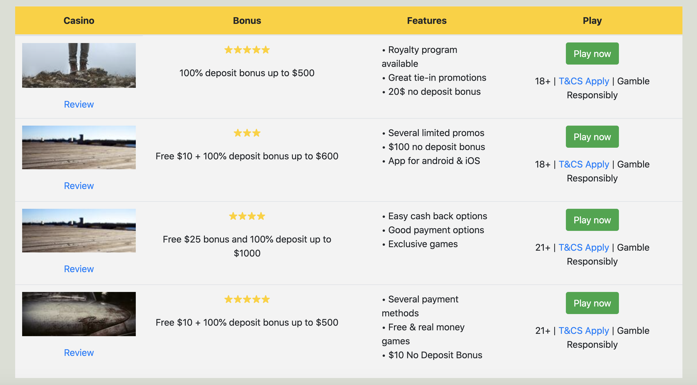

## Wordpress custom plugin from REST API 
The goal of this exercise is to create a Wordpress plugin which will fetch an array of reviews from an external REST API and display them in a nice list to the user.

## Stack

- Wordpress
- PHP 8.0.1
- Bootstrap
- CSS 
